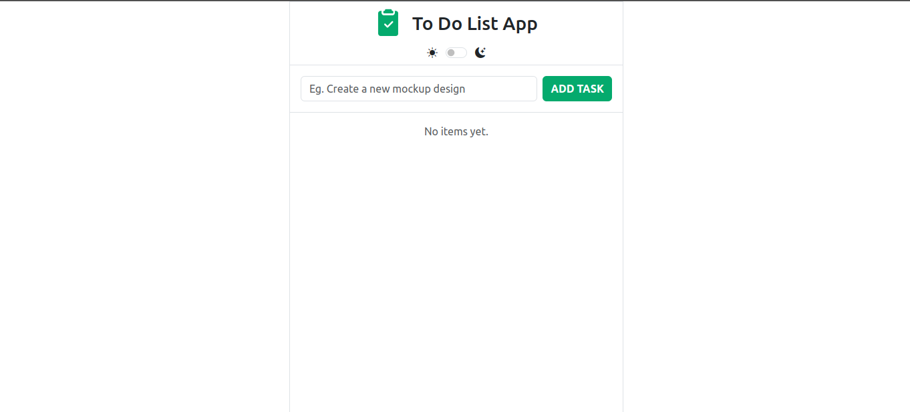

# 📝 To-Do List App

This is a simple and user-friendly to-do list application built with HTML, CSS, and JavaScript. It allows you to add tasks, mark them as completed, and delete them. Additionally, it features a dark mode theme toggle.

## ✨ Features

- **Add new tasks**
- **Mark tasks as completed** (strikethrough and greyed out)
- **Delete tasks**
- **Dark mode toggle**

## 🛠 Technologies Used

-  **HTML**: For the basic structure of the application.
-  **CSS**: For styling the application's appearance and user interface.
-  **JavaScript**: For adding interactivity and functionality to the application.
-  **Bootstrap**: A CSS framework used for responsive design and common UI components.
-  **Vite**: For building and bundling the project.
-  **Firebase**: For deployment and hosting.

## ⚙️ How it Works

1. **Enter your task** description in the input field at the top.
2. Click the **"ADD TASK"** button to add the task to the list.
3. Click the **checkbox** next to a task to mark it as completed.
4. Click the **trash can icon** next to a task to delete it.
5. Use the **toggle switch** at the top to switch between light and dark mode themes.

## 📸 Screenshots




## 📦 Installation

### To run the app locally, follow these steps:

**Clone the repository:**
```sh
git clone https://github.com/your-username/to-do-list-app.git
```

### Navigate to the project directory:

**Install the dependencies:** <br>
``` npm install```

**Run the development server:**
<br>
``` npm run dev```

## 🚀 Usage:
To use the app, open your browser and navigate to the Firebase-hosted URL or run it locally using the development server.

## 🎨 Customization:

* You can customize the application's appearance by editing the `style.css` file.
* You can add additional features to the application by editing the `main.js` file (JavaScript knowledge required).

**Feel free to use and modify this application for your personal use!**

## 📝 Version:
1.0.0

## License:
This project is licensed under the MIT License. See the LICENSE file for more details.

## 📧 Contact
Tharindu Rukshan<br>
[tharindurukshan709@gmail.com](mailto:tharindurukshan709@gmail.com)


